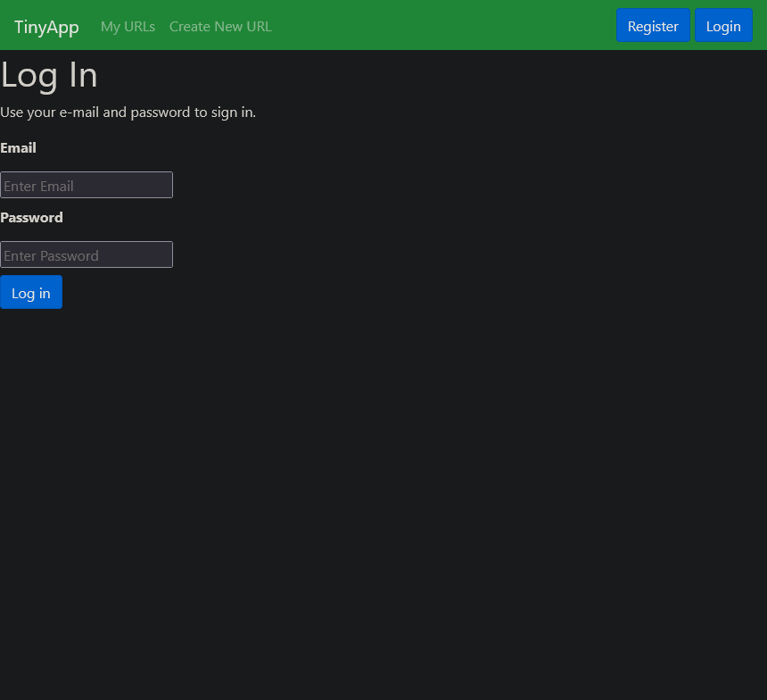
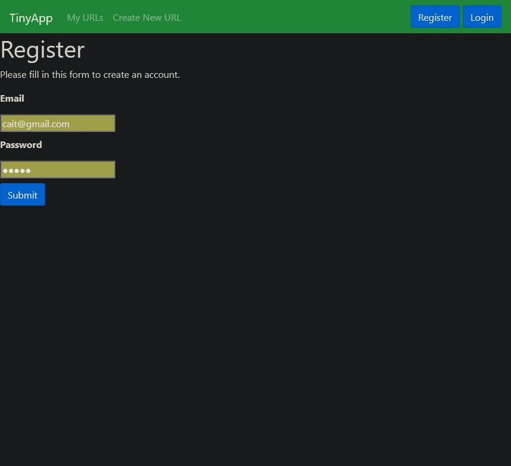
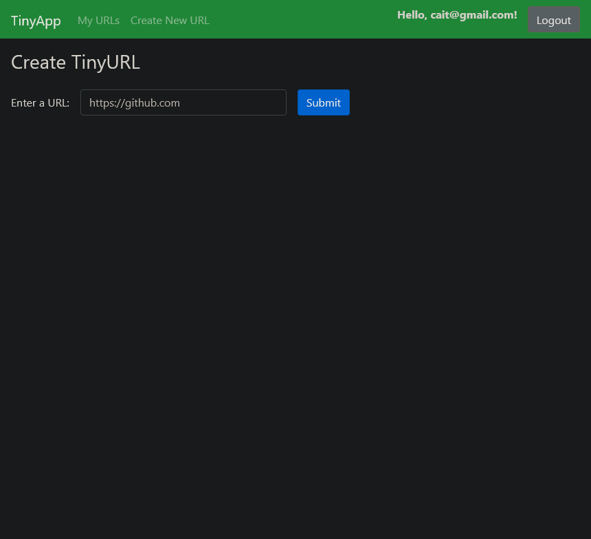
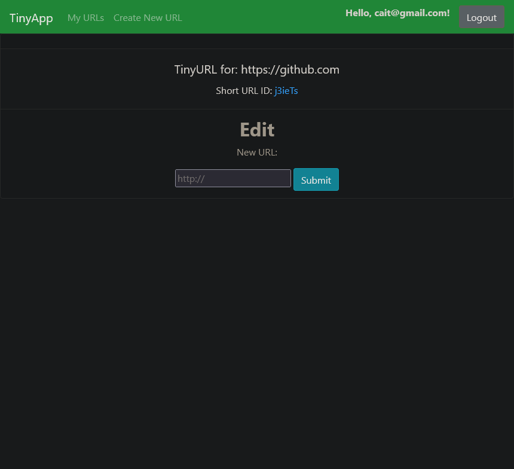
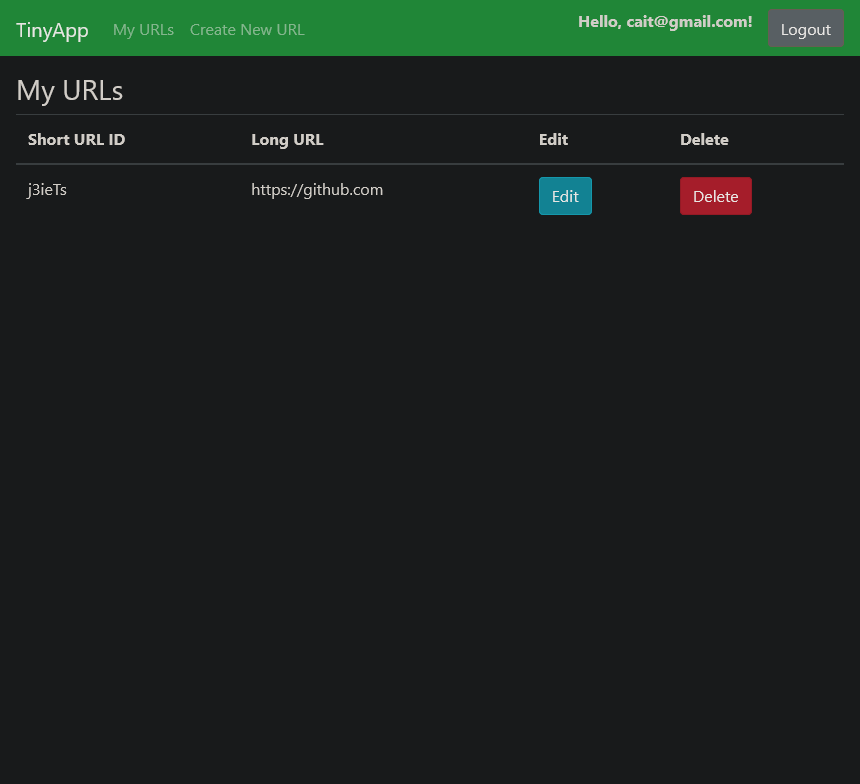

# TinyApp

TinyApp is a lightweight and user-friendly web application for shortening URLs. It allows users to easily generate shorter, more manageable versions of long URLs, making sharing and tracking links simpler!

## Features

- Shorten long URLs into tiny, memorable links.
- Customize shortened URLs with user-defined aliases.
- Secure user authentication and authorization.
- Simple and intuitive user interface.

## Technologies Used

- **Frontend:** HTML, CSS, JavaScript
- **Backend:** Node.js, Express.js
- **Authentication:** cookie-session, bcryptjs

## Installation

1. Clone the repository:
` git clone git@github.com:nicoayamen/tinyapp.git `

2. Move into the /tinyapp directory
` cd tinyapp/ `

3. Install all dependancies using npm install

4. Ensure port :8080 is open

5. Run ther server inside the tinyapp directory using:
` node express_server.js `

6. Most important of all... Have fun!

## Final Product 

## Special Thanks

- A special thank you to all the mentors at Lighthouse Labs who assited me in my darkest coding hours!

